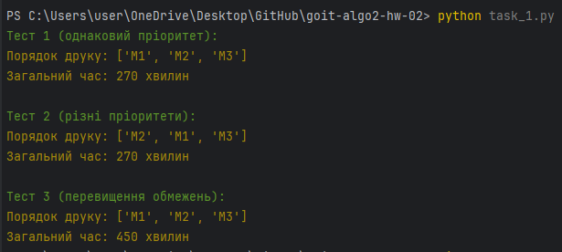
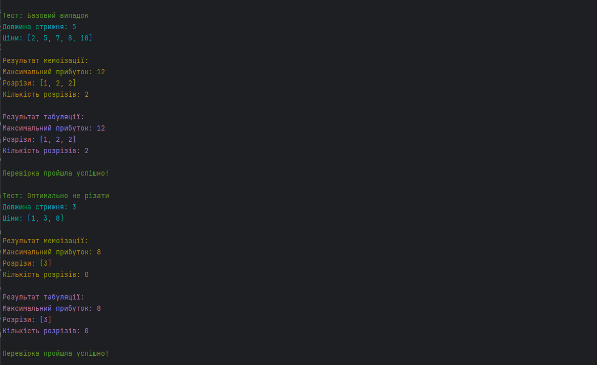
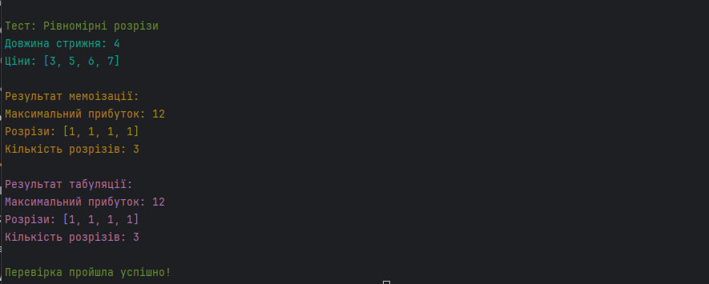

# HW-2 | Greedy Algorithms and Dynamic Programming

# Homework on "Greedy Algorithms and Dynamic Programming"

---

## Greetings!

How are you feeling? We hope you're eagerly rubbing your hands, ready for a new
challenge! 😉

This homework consists of two independent tasks. In the first task, you will 
learn to optimize a task queue based on priorities and constraints using greedy
algorithms for efficient resource management. In the second task, you will 
apply dynamic programming techniques to optimize solutions using memoization 
and tabulation.

Let this homework expand your perspective on greedy algorithms and dynamic 
programming! 🧠

---

## Task 1: Optimizing the 3D Printer Queue in a University Lab

### Develop a program to optimize the 3D printing queue, considering priorities and printer constraints, using a greedy algorithm.

### Task Description:

1. Use input data in the form of a list of print jobs, where each job includes: ID, model volume, priority, and print time.

2. Implement the main function `optimize_printing`, which will:
   - Consider task priorities.
   - Group models for simultaneous printing.
   - Check volume and quantity constraints.
   - Calculate the total print time.
   - Return the optimal print order.

3. Output the optimal print order and the total execution time of all tasks.

### Technical Requirements:

1. Expected output format of the `optimize_printing` function:

```json
{
    "print_order": ["M1", "M2", "M3"],  // Print order of tasks
    "total_time": 360  // Total time in minutes
}
```

2. Input format for print jobs:

```python
print_jobs = [
    {
        "id": str,  # Unique identifier
        "volume": float,  # Volume in cm³ (> 0)
        "priority": int,  # Priority (1, 2, or 3)
        "print_time": int  # Print time in minutes (> 0)
    }
]
```

3. Printer constraints format:

```python
printer_constraints = {
    "max_volume": float,  # Maximum volume for printing
    "max_items": int  # Maximum number of models
}
```

4. Task priorities:
   - **1 (Highest)** – Course/Thesis projects
   - **2** – Laboratory work
   - **3 (Lowest)** – Personal projects

### Acceptance Criteria:

📌 The acceptance criteria are mandatory for the mentor to review your submission. If any criteria are not met, the assignment will be returned for revision without evaluation. If you are stuck at any stage, feel free to ask your mentor in Slack.

- The program groups models for simultaneous printing without exceeding constraints (10 points).
- Higher-priority tasks are executed first (10 points).
- The printing time of a group of models is calculated as the maximum time among the models in the group (10 points).
- The program handles all test scenarios (10 points):
  - Tasks with the same priority.
  - Tasks with different priorities.
  - Printer constraint violations.
- The code uses `dataclass` for data structures (10 points).

### Program Template:

```python
from typing import List, Dict
from dataclasses import dataclass

@dataclass
class PrintJob:
    id: str
    volume: float
    priority: int
    print_time: int

@dataclass
class PrinterConstraints:
    max_volume: float
    max_items: int

def optimize_printing(print_jobs: List[Dict], constraints: Dict) -> Dict:
    """
    Optimizes the 3D printing queue based on priorities and printer constraints.
    """
    # Your code here

    return {
        "print_order": None,
        "total_time": None
    }

# Testing
if __name__ == "__main__":
    # Define test cases and execute them
    pass
```

---

## Task 2: Optimal Rod Cutting for Maximum Profit (Rod Cutting Problem)

### Develop a program to find the optimal way to cut a rod to achieve maximum profit. Implement two approaches: memoization and tabulation.

### Task Description:

1. The input consists of the rod length and a price array where `prices[i]` represents the price of a rod of length `i+1`.
2. Determine how to cut the rod to maximize profit.
3. Implement both dynamic programming approaches.
4. Output the optimal cutting strategy and maximum profit.

### Technical Requirements:

1. Input format:

```python
length = 5  # Rod length
prices = [2, 5, 7, 8, 10]  # Prices for lengths 1, 2, 3, 4, 5
```

2. Constraints:
   - Rod length > 0.
   - All prices > 0.
   - The price array cannot be empty.
   - The length of the price array must match the rod length.

### Acceptance Criteria:

1. The program implements two methods (10 points each):

```python
def rod_cutting_memo(length: int, prices: List[int]) -> Dict:
    """ Finds the optimal cutting strategy using memoization """
    pass

def rod_cutting_table(length: int, prices: List[int]) -> Dict:
    """ Finds the optimal cutting strategy using tabulation """
    pass
```

2. Each method returns a dictionary:
   - Maximum profit (10 points).
   - List of cut segment lengths (10 points).
   - Total number of cuts (10 points).

### Expected Output Format:

```json
{
    "max_profit": 12,  // Maximum profit
    "cuts": [2, 2, 1],  // List of segment lengths
    "number_of_cuts": 2  // Number of cuts
}
```

### Program Template:

```python
from typing import List, Dict

def rod_cutting_memo(length: int, prices: List[int]) -> Dict:
    """
    Finds the optimal cutting strategy using memoization.
    """
    # Your code here
    return {
        "max_profit": None,
        "cuts": None,
        "number_of_cuts": None
    }

def rod_cutting_table(length: int, prices: List[int]) -> Dict:
    """
    Finds the optimal cutting strategy using tabulation.
    """
    # Your code here
    return {
        "max_profit": None,
        "cuts": None,
        "number_of_cuts": None
    }

# Run tests
if __name__ == "__main__":
    # Define test cases and execute them
    pass
```

### Expected Results:

```plaintext
Test: Basic Case
Rod Length: 5
Prices: [2, 5, 7, 8, 10]

Memoization Result:
Max Profit: 12
Cuts: [1, 2, 2]
Number of Cuts: 2

Tabulation Result:
Max Profit: 12
Cuts: [2, 2, 1]
Number of Cuts: 2

Test passed successfully!
```

---

### Good luck with the assignment! 🚀

# TASK RESULTS



